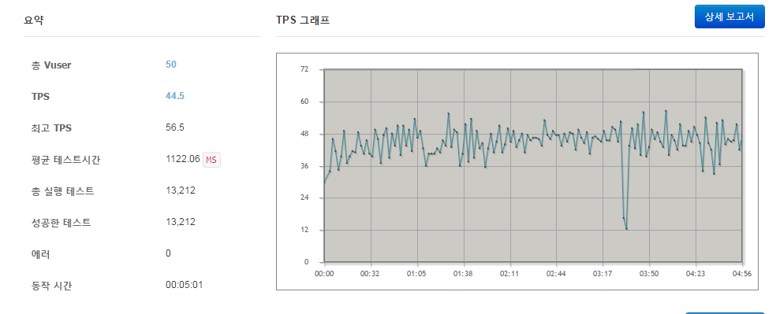
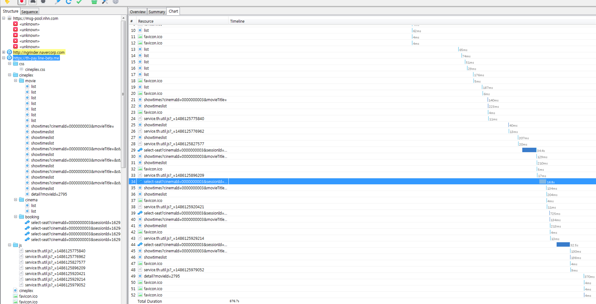
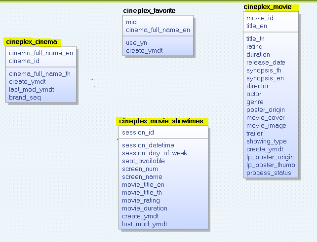
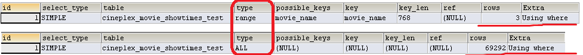
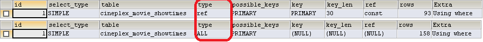

# Building a Faster and Stronger Web -Major Cineplex 앱보다 빠르게

성능의 중요성에 대해 간략히 살펴보고 LINE Pay x MajorCineplex 프로젝트를 진행하면서 성능 향상에 고민했던 내용과 성능테스트 예시와 적용한 사례들을 공유하고 더 좋은 방법은 없는지 토론하면 좋겠습니다.

## 왜 성능이 중요한가? - 사용자 사용패턴

<table>
	<tr>
	<td>Delay</td>
	<td>사용자 반응</td>
	</tr>
	<tr>
	<td>0 ~ 100 ms</td>
	<td>집중</td>
	</tr>
	<tr>
	<td>100 ~ 300 ms</td>
	<td>약간의 delay 감지</td>
	</tr>
	<tr>
	<td>300 ~ 1000 ms</td>
	<td>delay 에 집중</td>
	</tr>
	<tr>
	<td>1 s+</td>
	<td>딴생각을 하게될 확률이 높아짐..</td>
	</tr>
	<tr>
	<td>10 s+</td>
	<td>다시 방문 하지 않을테다..</td>
	</tr>
</table>
[표1. web/mobile 응답지연에 따른 사용자 반응 패턴]

*	300ms ~ 1초 사이에 로딩이 되는 페이지에 집중정도가 가장 높다.
*	지연이 되는 사이트는 사용자가 다시 방문하지 않을 확률이 굉장히 높다.
* 	1 초 사이에 응답이 올수있도록 목표로 잡자!

## 성능테스트 시작하기
성능테스트를 했으면 좋겠다는 요구사항이 있어 본격적으로 보기 시작했지만 성능향상을 위한 노력은 알게 모르게 하고 있을 것 이다.
그동안 여기저기서 들은 성능을 위해 개발자가 해야하는 방법에 대해 알아보고 효과적으로 테스트 하기위해 어떻게 해야 할지 생각해보도록 하겠다.
프로젝트 오픈전 성능테스트는 어떻게 할까... 고민을 많이 했다.

#### 성능이란 ? 성능테스트는 어디에 중점을 두어야 할까?
 - 최종 사용자가 체감하는 성능, 업무 수행에 소요되는 응답시간
 - 얼마만큼의 부하를 견딜 수 있는가? 시스템의 부하 임계치 (LOAD)
 - 범위가 너무 넓다
 
#### 성능측정 ?
- 어떤 툴로 어떻게 테스트 하나?
- 서버부하테스트 : nGrinder
- 응답속도테스트 : chrome, 와이어샤크, charles, fiddler 등
 
#### 성능검증 ? 분석, 최적화
 - 프로젝트 오픈전에는 목표 TPS, 목표 응답시간을 정한다.
 - 구간별 성능 측정을 통해 정확한 성능 저하 요인 파악 및 조치를한다.
 
## major cineplex 성능 측정
#### 1. nGrinder 부하테스트
사내 nGrinder를 이용해 부하테스트 진행 

* 극장 상영정보 엔드페이지의 부하테스트 설정값
<table>
	<tr>
	<td>Vuser</td>
	<td>50</td>
	</tr>
	<tr>
	<td>테스트시간</td>
	<td>5분</td>
	</tr>
	<tr>
	<td>스크립트</td>
	<td>default</td>
	</tr>
</table>


[그림 1] Major Cineplex 부하 테스트 결과

- 준비단계
 - 실제 사용자 PV분석하여 적정 설정값 선택
 - 라인메신저 pv 및 다른 앱뷰 서비스 pv 확인
- 측정상세  
 - TPS 결과에 따라 REAL 장비 1 대당 85/388TPS 이상 나올 것으로 예상
- 분석 및 대응
 - 태국 라인페이 하루 pv : 8000
 - 예상 TPS : 5~10 
 - 성능테스트 결과가 예상 TPS 보다 높으므로 이슈없을 것 같다.
 
- 자세한 측정의 어려움
 - 가상사용자로 실제 사용자를 대체
 - 정확한 사용자수 예측이 어렵다.
 - 테스트 데이터 부족하고, 부하 발생 예측이 어렵다.

#### 2. 모바일웹 응답속도 확인
- 라인 채널 웹뷰는 앱하고 token을 주고 받아 인증 후에 띄우는 방식이라 실제 앱에서 테스트를 해야만 했다.. 
- 찰스 : HTTP proxy를 구성해서 웹 클라이언트와 서버 사이를 오가는 통신을 가로채서 둘 사이의 모든 요청과 응답, 
 그리고 HTTP headers를 적나라하게 보 여주는 아주 막강한 웹 디버깅 애플리케이션 이다.
- 유료툴이므로 학습시간 및 비용 소요된다. (사내라이선스 )
- 앱 proxy 설정방법 : https://github.com/yeonji-oh/study/blob/master/seminar/charlesProxySetting.md


[그림 3] charles 실행 화면

- 분석
 - Major cineplex Api 통신부분을 제외한 응답속도 목표시간(~ 1s+) 확인
 - 실시간성 api 응답속도는 10s+ 이상 걸린다. ==> 개선필요
 
## major cineplex 성능 측정에 따른 대응
#### 1. Major API 응답 지연에 대한 방안
- major cineplex 에서 영화관, 영화, 상영정보, 좌석정보, 티켓정보 필요한 데이터를 API를 통해 전달받는다.
- API 응답속도 느림.

###### 방법)
- 실시간으로 api 호출하지 않고 대량 데이터 여부 및 데이터의 적시성 여부에 따라 일부를 배치 방식으로 개선한다.
- 일배치로 API 데이터 받아 DB에 저장한다.



[그림 4] Major Cineplex batch data db schema

###### 이슈1) 실시간 API 호출 시 
- 예매 가능한 좌석정보는 적시성을 요하는 정보로 실시간으로 서비스를 해야한다. (batch 관리 어려움)	
- Timeout 지정해서 지연되면 alert 문구 노출로 노티 > 로딩화면 시간을 최소화 한다.	
- 하지만 문구노출이 빈번해 져서 불안정한 서비스처럼 보이는건 비슷하다.
- 적합한 타임아웃값을 찾는 것이 쉽지 않다.

###### 질문) 외부 api 응답 지연시 빠르게 보일 수 있는 방법이 있나요?
- 있다?
- 어쩔수 없다...

###### 이슈2)
- 7만건의 영화상영정보 API가 업데이트가 빈번히 일어난다.

## 성능최적화 1 (Front-End)
모바일 디바이스는 하드웨어 성능이 PC 비해 매우 낮고, 모바일 디바이스의 종류도 매우 다양하기 때문에 최적화가 PC 보다 더 까다롭다.
브라우저의 렌더링 엔진, 자바스크립트 실행 엔진의 성능도 중요하다.
렌더링한 결과를 보여주는 그래픽 디바이스나 디바이스 드라이버의 성능 또한 브라우저 성능에 지대한 영향을 끼친다.

###### 보이지 않는 부분은 지연로딩 (lazy-loading) 기법을 사용한다.
- Home > 영화 리스트 > 페이징 (lazy loading) : 페이지 앤드에 다다르면 다음 20개 불러온다.
- 장점 : 초기 페이지 로딩 체감 속도 향상 기대, 사용자가 명시적으로 페이징 데이터를 요청하지 않아도 된다.
- 단점 : 스크립트 과다 사용에 의한 성능 감소

###### js, CSS, Image 파일 cdn 업로드
- 이미지와 스타일링은 Front-end 성능 최적화의 핵심요소 이다.
- 절한 component의 선택은 서비스의 확장성(Scalability)뿐 아니라 성능에도 영향을 준다 ==> CDN
- 장점 
 - CDN과 도메인이 분리되어 있어 로컬 컨텐츠들과 cdn을 병렬로 다운로드 할 수 있다.
 - CDN 캐시를 통해 더 빠른 속도로 읽어 올 수 있다.
- 자바스크립트의 크기도 중요하지만 자바스크립트가 실제로 로드되어 메모리를 얼마나 사용하는지도 성능의 고려 대상이다.

###### 기타 Front-End 성능 tips
- 인라인 이미지 (inline image) 등을 이용해서 가급적 서버로의 요청 횟수를 줄인다.
- 불필요한 HTML 제거한다.
 - HTML5 시맨틱 태그인 \<header\>,  \<footer\>, \<nav\> 등을 이용해 필요한 HTML 코드의 크기를 줄인다.
 - 주석을 제거 한다.
- Ontouched 이벤트를 사용한다. Onclick 이벤트보다 300~500ms 더 빠르다.
- 애니메이션은자바스크립트로 만들지 말고 css3의 transition 속성이나 애니메이션 기능을 사용한다.
- 자바스크립트로 DOM에 접근할 때 매우 느리다. 
 - 그래서 새로운 데이터를 저장할 때에는 가급적 DOM 구조에 저장하지 말고 자바스크립트 변수에 넣어 두고 사용한다.

## 성능최적화 2 (성능향상을 위한 mysql 쿼리 작성)
- 성능향상을 위한 또 하나의 방법은 쿼리 수행속도를 빠르게 하는 방법이 있다.
- 앞에서 설명한 방법으로도 성능향상이 가능하지만 쿼리튜닝으로 몇십 배에서 몇백 배의 성능향상이 가능하다.
- 쿼리성능 하면 가장먼저 떠오르는 것은 인덱스! 실행계획을 분석하여 쿼리성능을 최적화 해보자.

#### 1. 영화 상영시간 정보 테이블 > 대량의 데이터 빈번한 업데이트 (약 7만건) 
- 오랜 업데이트로 select 조회시 이슈 없는지? 혹시 레코드락 으로 select 조회 영향이 있지 ?
 - 결론 : 이슈없음.
 - mysql의 isolation 수준에따라 달라지겠지만 보통의 READ COMMITED 에서는 select 조회시 update 수행전 기록되는 UNDO 로그를 읽는다.
 
- 업데이트 성능 ?
 - Multi insert, ON DUPLICATE KEY UPDATE
  - 인덱스가 생성된 테이블에서 insert 구문이 수행이 되면 추가된 레코드를 포함하여 인덱스를 재생성 한다.(성능저하)
  - insert 속도를 최적화하려면 작은 작업들을 하나의 큰 작업으로 결합 하면 된다.
  - 단일 연결을 만들고, 한번에 새로운 행의 데이터들을 보내고, multi row 의 작업이 끝난 후 인덱스 업데이트 및 일관성 검사를 하면된다.
  - 하지만 대량의 데이터 업데이트 시 out of memory 발생 한다. (5000건이상부터는 느려지고 10000건 업데이트 시 에러발생)
  - 쿼리생성 전 파라메터로 보내는 리스트의 null 체크가 필요하다.
  
```xml
INSERT INTO cineplex_movie_showtimes
      (cinema_id, session_id, session_datetime, session_day_of_week, seat_available, screen_num, screen_name, movie_title_en, movie_title_en2, movie_title_th, movie_rating, movie_duration, create_ymdt, last_mod_ymdt)
     VALUES
    <foreach collection="list" item="showtime" separator=",">
     (
        #{showtime.cinemaId},
        #{showtime.sessionId},
        #{showtime.sessionDateTime},
        #{showtime.sessionDayOfWeek},
        #{showtime.seatsAvailable},
        #{showtime.screenNum},
        #{showtime.screenName},
        #{showtime.movieName},
        #{showtime.movieTitleEn2},
        #{showtime.movieName2},
        #{showtime.movieRating},
        #{showtime.filmDuration},
        NOW(),
        NOW()
        )
    </foreach>
     ON DUPLICATE KEY UPDATE
      cinema_id = VALUES(cinema_id),
      session_id = VALUES(session_id),
      session_datetime = VALUES(session_datetime),
      session_day_of_week = VALUES(session_day_of_week),
      seat_available = VALUES(seat_available),
      screen_num = VALUES(screen_num),
      screen_name = VALUES(screen_name),
      movie_title_en = VALUES(movie_title_en),
      movie_title_th = VALUES(movie_title_th),
      movie_rating = VALUES(movie_rating),
      movie_duration = VALUES(movie_duration),
      last_mod_ymdt = NOW()
```
 
- wiki: [업데이트 로직 수행속도 테스트][linepay]
   [linepay]: http://wiki.navercorp.com/pages/viewpage.action?pageId=331925875 "Go linepay"
   
#### 2. 영화 정보 테이블, 영화 상영시간 정보 테이블 > 영화이름 LIKE 연산
- 영화 리스트, 영화 상영시간 Major cineplex API 통해 전달받는다.
- 그런데.. 각각의 API 에서 넘어오는 영화이름이 상이하다.
 - ex) 반지의 제왕3 vs 반지의 제왕3(3DX), 반지의 제왕3(4DX), 반지의 제왕3(IMAX)
- 영화선택 후 예매진행하려 할 때 영화 테이블과 상영시간 테이블의 LIKE 연산이 필요하다.

- LIKE 연산이 성능저하를 가져올까봐 테스트를 해보았다.

```xml
EXPLAIN SELECT * FROM cineplex_movie_showtimes_test WHERE movie_title_en LIKE 'Raiders%';

EXPLAIN SELECT * FROM cineplex_movie_showtimes_test WHERE movie_title_en LIKE '%Raiders%';
```


[그림 5] like 연산자 실행계획

- LIKE 연산자는 와일드카드 문자가 검색어 뒤쪽에 있다면 인덱스 레인지 스캔으로 사용할 수 있다. 
- 와일드 카드가 앞쪽에 있으면 인덱스의 특성으로 레인지스켄 사용 못하고 테이블 풀 스캔 방식으로 쿼리 처리한다.

#### 3. 프로모션 > 공유된 url로 결제시 > 포인트 지급 > 유저당 누적 포인트 group by
- group by절에 명시된 칼럼의 순서가 인덱스를 구성하는 컬럼의 순서와 같으면 일단 인덱스를 이용할 수 있다.
 - Group by 절에 명시된 칼럼이 인덱스 칼럼의 순서와 위치가 같아야 한다.
 - 인덱스를 구성하는 컬럼 중에서 뒤쪽에 있는 칼럼은 group by 절에 명시되어 있지 않아도 인덱스를 사용할 수 있지만 인덱스의 앞쪽에 있는 칼럼이 groub by 절에 명시되지 않으면 인덱스를 사용할 수 없다.
 - Where 조건 절과는 달리 groupby 절에 명시된 컬럼이 하나라도 인덱스에 없다면 group by 절은 전혀 인덱스를 이용하지 못한다. 

```xml
EXPLAIN SELECT
        sh.mid AS MID,
        DATE_FORMAT(NOW(), '%Y%m%d') AS createYmd,
        IF (COUNT(sh.mid) * 25 > 200, 200, COUNT(sh.mid) * 25) AS rewardAmount
    FROM cineplex_share sh INNER JOIN cineplex_share_payment shp ON sh.share_seq = shp.share_seq 
    AND sh.create_ymdt >= '2017-01-26 00:00:00' AND sh.create_ymdt <= '2017-01-26 23:59:59'
    GROUP BY sh.mid ORDER BY NULL
```

- ORDER BY NULL
 - group by는 내부적으로 정렬도 동시에 일어난다. 
 - order by를 명시하지 않아도 group by a, b order by a, b 로 처리한다. ==> 성능저하의 원인
 - 그룹핑은 하되 정렬은 필요 없을 경우 사용한다.
   
#### 4. subquery
- select절에 사용된 서브쿼리
 - 내부적으로 임시테이블을 만든다거나 쿼리를 비효율적으로 실행하도록 만들지는 않기 때문에 서브쿼리가 적절히 인덱스를 사용할 수 있다면 크게 주의할 사항은 없다.
 - 하지만 조인으로 처리해도 되는 쿼리를 select 의 서브 쿼리를 사용해서 작성할 때도 있다.
 - 서브쿼리로 실행하는 것보다는 조인으로 처리할 때가 훨씬 빠르기 때문에 가능하다면 조인으로 쿼리를 작성하는 것이 좋다
 
- where절에 단순비교로 사용된 서브쿼리
```xml
Select * from dept_emp de
Where de.emp_no = 
(select e.emp_no from employess e where e.first_name=’georigi’ and e.last_name=’facello’ limit 1)
```

- mysql 은 서브 쿼리의 최적화가 부족하다.
- 예상
 - 서브쿼리를 먼저 실행 후 상수로 변환하고, 그 조건을 범위 제한 조건으로 사용한다. ==> 일반적
 - mysql 5 이하 : dept_emp 테이블을 풀 테이블 스캔으로 레코드를 한건씩 읽으면서 서브쿼리를 매번 실행해서 서브쿼리가 포함된 조건이 참인지 비교
 - mysql 5.5 이상 : 서브쿼리가 먼저 실행되어 그 결과를 외부쿼리의 조건으로 사용한다.
 
 ```xml
Select * from dept_emp de
Where de.dept_no IN 
(select d.dept_no from departments d where d.dept_name=’FINANCE’)
```
- where 절에 in과 함께 사용된 서브쿼리
 - mysql 5 이하 : mysql 옵티마이저에 의해 in 부분이 exists 형태로 변환되어 실행 되어 외부 쿼리를 풀테이블 스캔을 사용할 수 밖에 없다.
 - mysql 5.5 이상 : 최적화 됨
 
 ```xml
 EXPLAIN SELECT * FROM cineplex_movie_showtimes WHERE movie_title_en IN (SELECT movie_title_en FROM cineplex_movie WHERE movie_title_en = 'Jumanji');
EXPLAIN SELECT * FROM cineplex_movie_showtimes WHERE movie_title_en = (SELECT movie_title_en FROM cineplex_movie LIMIT 1);
EXPLAIN SELECT * FROM cineplex_movie_showtimes WHERE movie_title_en NOT IN (SELECT movie_title_en FROM cineplex_movie WHERE movie_title_en = 'Jumanji');
 ```


[그림 6] subquery 실행계획

#### 5. where 조건이 인덱스를 사용하는 방법
- 크게 범위 제한 조건과 체크 조건으로 구분한다.
```xml
SELECT * FROM dept_emp
WHERE dept_no BETWEEN ‘d003’ AND ‘d005’ AND emp_no = 10001;

idx (dept_no, emp_no)
```

- 두개의 컬럼이 순서대로 결합 인덱스일 경우 dept_no 조건이 동등조건이 아닌 크다 작다 비교이므로 뒤 컬럼인 emp_no 조건은 범위 제한 조건으로 사용되지 못하고 체크 조건으로 사용된다.

#### 6. 조건이 or 일 때 주의
```xml
SELECT *  FROM employes
WHERE first_name = ‘kebin’ OR last_name = ‘Poly’;

idx (first_name)
```

- first_name 은 인덱스 이용가능, last_name은 인덱스를 사용할 수 없다.(풀테이블 스캔)
- 풀테이블 스캔 + 인덱스 레인지 스캔 보다는 플테이블 스캔 한번이 더 빠르기 때문에 위에 경우는 풀 스캔이 일어난다.
- 만약 각 컬럼에 인덱스가 있다면 index_merge 접근 방법으로 실행 할 수 있다. 
- 하지만… 제대로된 인덱스 하나를 레인지 스캔 하는 것보다는 느리다…

#### 7. 문자열과 숫자 비교
- cinema_id는 문자열 컬럼, where절 문자열 vs 숫자비교

```xml
EXPLAIN SELECT * FROM cineplex_movie_showtimes WHERE cinema_id = '0000000002';
EXPLAIN SELECT * FROM cineplex_movie_showtimes WHERE cinema_id = 0000000002;
```


[그림 7] 문자열, 숫자비교 

- mysql이 내부적으로 문자열 타입을 숫자 타입으로 변환 후 비교 작업을 처리한다.
- 이러한 문제는 문자열 비교보다 숫자 값의 비교가 빨라서 mysql 옵티마이저가 숫자 타입에 우선권을 부여하기 때문에 발생하는 문제이다.
- mysql 특징으로 컬럼 타입에 맞지 않는 다른 타입이 들어오면 자동 변환되서 들어가는데 자칫 놓칠 수 있는 부분이다.
- 저장하고자 하는 값의 타입에 맞게 칼럼의 타입을 선정하자.
- 반대로 테이블의 컬럼은 숫자타입인데, sql비교 조건을 문자열 값과 비교하는 경우에는 이런 현상이 발생하지 않는다. 
 - 상수값으로 지정한 문자열을 숫자타입으로 먼저 변환 후 cinema_id 컬럼과 비교하기 때문이다.
 
## 마치며
예전에 전사 이슈로 서비스 속도개선건이 화두에 오른적이 있었다. 그때는 Script, CSS, Image Size 등 Front-End 에 초점이 맞춰져 있었다. 그 후에 스크립트 lazy loading 이나 cdn 사용으로만 처리하고 성능테스트는 자세히 하지 않았던 것 같다. 대충 서비스 돌려보고.. 빠름, 보통, 느림 으로 구분을 했었다..
이번엔 기존에 존재하는 major Cineplex 앱이 너무 느려서.. line 웹뷰로 서비스를 할 때 좀더 빠르게 할 수 없을까.. 고민을 많이 했다.
사실 모바일관련 성능테스트에 대해 기술적으로 더 알아보고 싶었는데 자료도 별로 없는 것 같고 학습시간이 많이 필요할 것 같아 쿼리 쪽을 집중적으로 봤다. 이 후에도 네트워크 환경(3g, 4g, lte)은 성능등 모바일 최적화를 어떻게 하는지에 대해 계속 관심을 가질 생각이다.
이번을 계기로 성능 최적화에 대한 다방면으로 알 수 있었고, 쿼리성능 향상에 깊은 고민을 해본 좋은 기회라고 생각한다.
이런 내용을 알고 좋은 개발 습관을 가진다면 사용자의 만족도를 높이는 빠르고 좋은 서비스를 만들 수 있을 것 같다.

## 참고자료
- [도서] 개발자와 DBA를 위한 Real MySQL
- My SQL Documents : ttps://dev.mysql.com/doc/refman/5.7/en/insert-speed.html
