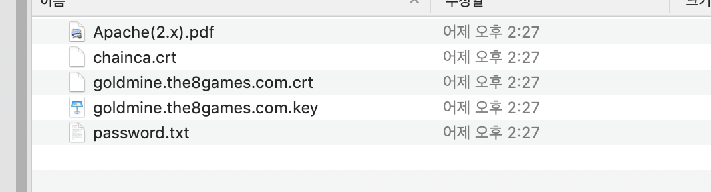

# Git 인증서 업데이트

참고
- https://help.github.com/en/enterprise/2.16/admin/installation/configuring-tls

Git 인증서 업데이트 도중 에러 발생
---
<h5 style="font:red;">Github ssl cert The certificate is not signed by a trusted certificate authority (CA) or the certificate chain is missing intermediate CA signing certificates.</h5>
---
 

## chainca.crt , goldmine.the8games.com.crt 결합
1. chainca.crt 파일 내용을 메모장으로 열어 goldmine.the8games.com.crt 데이터 뒤에 추가 후 저장

2. 1번에서 결합된 crt 파일은 업로드

 <b> * 인증서가 루트가 아니라 특정 기관 통해 발급되면 그 기관 정보가 chainca에 들어 있게 되고, 여러 단계 거처서 인증서 확인 되도록 해야해서 두 파일을 엮어서 업로드 해야함.</b>
